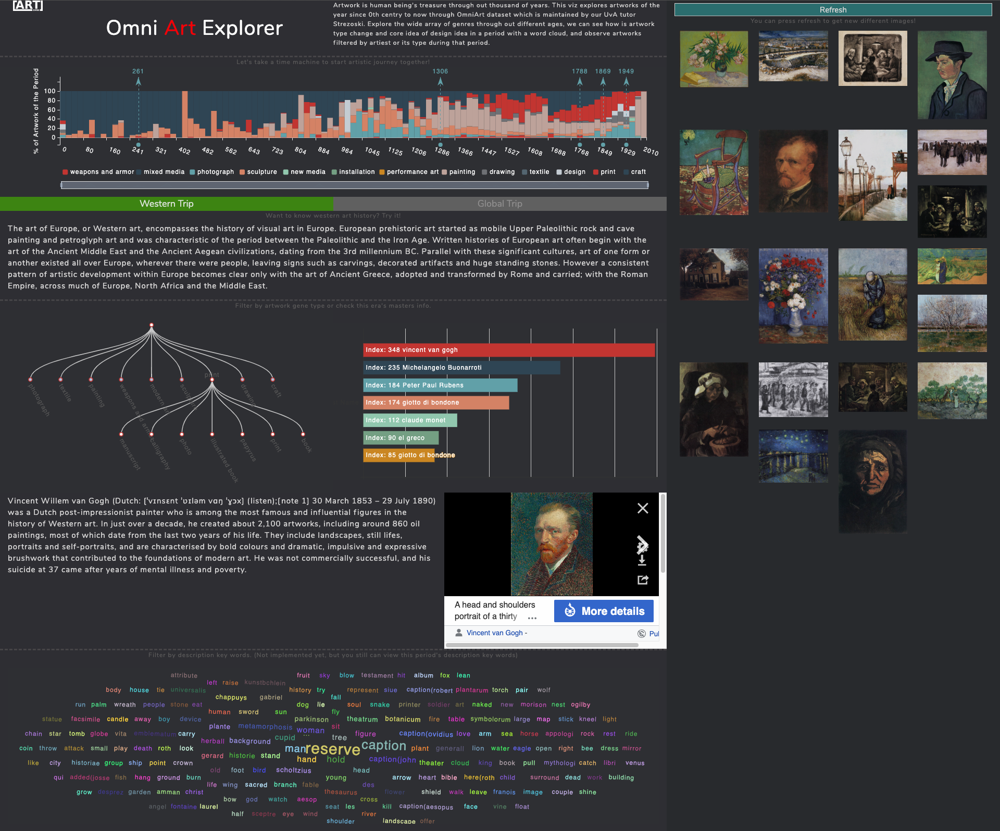

<h1 align="center">5204INVI6Y Information Visualization (Team Group 3)</h1>

<p align="center">
    
</p>

<p align="center">
    <i>
        <b>
        Group Members (Contribution High to Low) : <br>
        Kai Zhang: 12712469 (mail@kai.sh), 
        Xinran Yang: 12547425 (ryanyxr@gmail.com)
        Futong Han: 12581135 (hanfutong0804@gmail.com), 
        Chuyi Tong: 12663131 (c.tong@student.vu.nl), 
        </b>
    </i>
</p>

## General Idea

Artwork is human being's treasure through out thousand of years. This viz explores artworks of the year since 0th centry to now through OmniArt dataset which is maintained by our UvA tutor Strezoski. Explore the wide array of genres through out different ages, we can see how is artwork type change and core idea of design idea in a period with a word cloud, and observe artworks filtered by artiest or its type during that period.

Research question: How do we present arts and explorer so many art pieces?

## Data process pip-line

## Project Information Visualization Demo


## Run the project
__Pre-requirements:__ Python3.7, Java 8

* Install related Library
    ```
    pip3 install -r requirements.txt
    ```
* Start the website
    ```
  cd www
  export FLASK_APP=app.py
  flask run
    ```

## Related Information
* Website Theme: `Bootstrap Grayscale`

## Database Introduction
http://isis-data.science.uva.nl/strezoski/#2

## Database dataset
http://isis-data.science.uva.nl/strezoski/omniart/omniart_v3/


